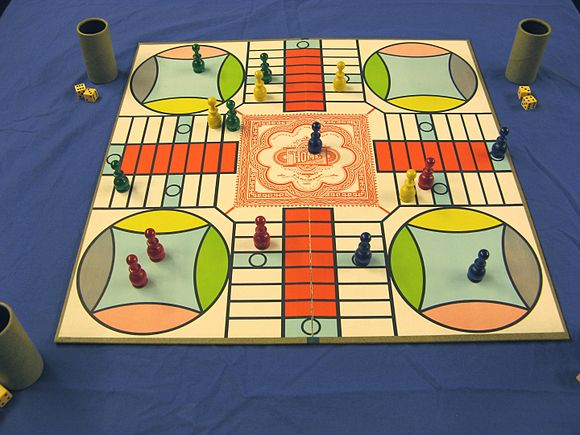

# parcheesi

A simulator for determining optimal parcheesi play

## Motivation

For a game with such incredibly simple rules, I find Parcheesi to be incredibly entertaining.  However, one thing that has been noticed is how long the games can take.

Why is this?  It must have something to do with how we are playing?  And if different strategies for playing lead to longer games, can they also really make a difference in terms of who wins?

## The Game

Parcheesi is a brand-name American adaptation of the Indian cross and circle board game Pachisi:

https://en.wikipedia.org/wiki/Parcheesi

Parcheesi is typically played with two dice, four pieces per player and a gameboard with a track around the outside, four corner spaces and four home paths leading to a central end space. The most popular Parcheesi boards in America have 68 spaces around the edge of the board, 12 of which are darkened safe spaces. Each corner of the board contains one player's nest, or starting area. 

### Setup

   * Each player positions their four single colored pieces in their respective starting nest.
   * Each player rolls a single die to determine player order. The player with the lowest roll goes first.
   * The order of players' turns moves to the next player on the current player's left.
   * Pieces move from the nest to the colored starting space to the left of the nest, per rules in the following section.

### Rules

Like a lot of games, I have been playing Parcheesi with silightly modified rules.  Here's the gist of how I play it:

A player rolls the dice and must use the topmost facing die pip values shown to move their pieces around the board in one of the following ways:

   * Only pieces not in the nest may move forward on the board.
   * Pieces may only leave the nest with a roll of a five on a single die or the sum of the dice. A double five can be used to move two pieces from the nest simultaneously.
   * In the case of a non-doubles roll, a player may move one or two pieces, either one piece by each of the numbers on the two dice or one piece by the total. If no move is possible, the turn is forfeited.
   * When moving a single piece the total of two dice the turn is taken in increments, allowing pieces to be captured along the way. For example, if a double two is rolled and an opponent's piece lies on a cream space two spaces in front of the piece you wish to move the full four, you would move the piece two, and then two again, allowing the opponent's piece to be captured.
   * All die rolls must be taken and may not be voluntarily forfeited by a player.
   * If a player cannot use both dice, the player must use one of the dice, if possible. If either can be used, the player must use the largest die.
   * When the player rolls doubles, the player rolls again after moving, provided all of the doubles roll was used. If the player is unable to use all of the roll, the player doesn't get another roll.
   * When a piece ends its move on the same space as an opponent's piece, the opponent's piece is sent back to its nest.
   * A piece may not be placed on a safe space (generally colored light blue) if it is occupied by an opponent's piece. The exception is the safe space used when a piece leaves its nest — a single piece occupying such a safe space is sent back to its nest when an opponent's piece leaves the nest and occupies the space.
   * A blockade is formed when two pieces occupy the same space. No piece of any player may move through a blockade, including pieces of the blockade owner. 

Winning the game:
   * Moving all four pieces to the home position wins the game.[1]
   * Pieces may only be moved to the home position with an exact application of the total roll, the value on a single die,   
  
### Strategies

One can see that sometimes there's not a lot of choices for the player to make: a lot is determined by the die roll and contraints on the board.

But when there are choices, what are the best options that would lead to winning?  And do some of these lead to longer games?  

A lot of these choices can be thought of in terms of offensive, or defensive moves.  Here's some examples of choices that a player can make:

   * when the opportunity arises to send back an oppenents piece to their nest, is it worth the risk of exposing this piece to attack itself?  Or advancing another piece?
   * does maintaining a blockade to keep opponent pieces from advancing worth the fact that these pieces in the blockade themselves are not advancing?  Even when there are other pieces that do get advanced?
   * when rolling a five and there are pieces in the nest, should the priority be to get these pieces out, over possibly securing or advancing other pieces?

## Design

We take a standard Object Oriented Programming approach, with classes representing pieces and players.  The board itself is represented as a list of numbers representing positions on the board.  A pygame interface is being implemented to visualize the game play and enable human vs. computer games, but is a work in progress.

Currently the game rules are mostly implemented in functions in a game module.  The game and the module should become classes themselves it seems.

In regards to strategies, there is only one current very simple strategy:
   * always get a piece out of the nest when possible
   * simply take the first legal move available to the piece that is furthest ahead

Obviously there is no regard for offensive or defensive moves yet.

## Current Results

Currently the only thing we can do is play a full game with randomized dice rolls and the above mentioned strategy.  But we can collect metrics such as how many turns the game takes, how many times each player is blocked or sent back to the nest, etc.

